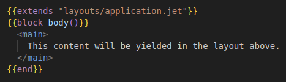
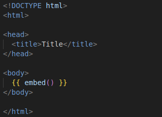

# Jet Template README

Unofficial Jet Template extension provides basic syntax highlighting support for ".jet" files using the JET templating format in Golang. The Jet template can be found here:  [GitHub](https://github.com/CloudyKit/jet).

This project is **not** maintained by CloudyKit; I just threw this together for myself in a day because it was better than nothing.

## Features

Adds basic syntax highlighting to `.jet` files including basic `html` syntax and some additional syntax highlighting for `.jet` keywords.

**Examples:**

## Worth Knowing

HTML Syntax highlighting is handled by Visual Studio Code by default. Any extensions that affect HTML highlighting might also affect html syntax highlighting in `.jet` files.

## Known Issues
- does not support built-in functions
- does not support error checking
